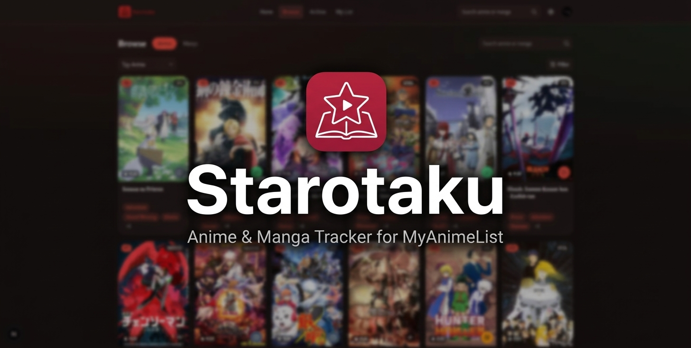

<div align="center">



Discover what's next, track what you're watching, and jump straight into an episode —
all wrapped around your real MyAnimeList account.

[](https://starotaku.vercel.app/)
[](https://myanimelist.net/apiconfig/references/api/v2)

[Try it now](https://starotaku.vercel.app/) · [Features](#features) · [Get Started](#getting-started) · [Android App](#android-app-trusted-web-activity)

</div>

---

## Why Starotaku

Most anime trackers make you choose: a clean list manager with no discovery, or a discovery
site that can't touch your list. Starotaku does both, on top of the account you already have on
MyAnimeList — no new sign-up, no second source of truth, no data silo.

## Features

### 🧭 Discover something new
- **Rankings** for anime and manga — airing now, upcoming, all-time top, most popular, most
  favorited — browsable by tab, with more loading as you scroll
- **Seasonal archive** — flip through any year and season the way MyAnimeList's own archive does
- **Unified search** across anime and manga, built right into Browse
- **Rich detail pages** — synopsis, key info, related titles, and recommendations for what to
  watch or read next

### ▶️ Watch without leaving the app
- Jump from an anime's detail page straight into an episode
- Automatically falls back to an alternate source if a stream is blocked, so playback keeps working
- Episode progress is tracked as you watch, syncing back to your MyAnimeList list

### ✅ Track your way
- Full **My Anime List** and **My Manga List** management — status, score, and progress, edited
  inline without leaving the grid
- Filter your list by genre, rating, or release date, and search within it
- **Profile page** with your account stats at a glance

### 🔐 Actually yours
- Sign in with your real MyAnimeList account (OAuth2) — every visitor gets their own session,
  never a shared login, and Starotaku never sees your password

### 🎨 Built to feel native
- Light and dark themes
- Responsive from phone to desktop — a bottom nav and full-screen sheets on mobile, an inline
  nav on desktop
- Installable as a Progressive Web App, or as a real [Android app](#android-app-trusted-web-activity)

## Getting Started

1. Register an app on MyAnimeList (*Profile Settings → API*), type **"other"** (PKCE public client). Set the redirect URI to `http://localhost:3001/auth/callback`.
2. Configure this app's environment:
   ```bash
   cp .env.example .env.local
   # MAL_CLIENT_ID: from your MAL app registration
   ```
3. Install dependencies and start the dev server:
   ```bash
   pnpm install
   pnpm dev
   ```
4. Open [http://localhost:3001](http://localhost:3001) and log in with MyAnimeList from the nav bar.

## For Developers

Built with Next.js 16 (App Router, Server Components, Server Actions) and TypeScript, styled
with Tailwind CSS v4 and Radix UI, talking directly to the [MyAnimeList API v2](https://myanimelist.net/apiconfig/references/api/v2)
— there's no backend of its own to run or deploy.

| Command | What it does |
| --- | --- |
| `pnpm dev` | Start the dev server (`:3001`) |
| `pnpm build` / `pnpm start` | Production build / run it |
| `pnpm typecheck` / `pnpm lint` | Type-check and lint |
| `pnpm test` / `pnpm test:e2e` | Unit tests (Vitest) / end-to-end tests (Playwright, against a mock MAL API) |

## Android App (Trusted Web Activity)

Starotaku ships as a real Android app via a [Trusted Web Activity](https://developer.chrome.com/docs/android/trusted-web-activity/) (TWA) — Chrome renders the actual production site (`https://starotaku.vercel.app/`) full-screen inside a thin native wrapper (`android/`, using [`androidbrowserhelper`](https://github.com/GoogleChrome/android-browser-helper)). It is **not** a WebView wrapper and does **not** bundle a copy of the app — the Android project has no business logic of its own, so the site keeps working (and updating) exactly as it does in a browser.

### A. Required tools

- **JDK 17+** (JDK 21 works) to run Gradle.
- **Android SDK** — easiest via [Android Studio](https://developer.android.com/studio) (open `android/` as a project and it will offer to install missing SDK components), or the standalone [command-line tools](https://developer.android.com/tools/releases/cmdline-tools) + `sdkmanager` if you'd rather not install the full IDE.
- Optionally, the [Bubblewrap CLI](https://github.com/GoogleChromeLabs/bubblewrap) (`npm i -g @bubblewrap/cli`) if you'd rather regenerate/update the Android project from `android/twa-manifest.json` than hand-edit Gradle files.

### B. Package / application ID

- Package ID: **`to.myanilist.app`** (set in `android/app/build.gradle`'s `namespace`/`applicationId`, `android/twa-manifest.json`, and `public/.well-known/assetlinks.json`). Keep all three in sync if you ever change it. Kept as-is from this project's original name despite the app-facing rebrands (first to Anivio, now to Starotaku) — changing it would create a new Play Store listing rather than updating the existing one.
- App name: **Starotaku** (`android/app/src/main/res/values/strings.xml`).

### C. Create the release signing key

Play Store releases must be signed with a real release key you generate and keep — never a debug key, and never one I invent for you:

```bash
keytool -genkeypair -v -storetype PKCS12 \
  -keystore android/release.jks \
  -alias myanilist \
  -keyalg RSA -keysize 2048 -validity 10000
```

The alias stays `myanilist` (this project's original name) even after the app-facing rebrands (first to Anivio, now to Starotaku) — it's just a local keystore label, not user-visible, and renaming it would require re-signing.

```bash
```

You'll be prompted for a store password, a key password, and your identity details — pick a strong password and **store it somewhere safe** (a password manager). Losing this file or its password means you can never publish an update to the same Play Store listing again.

### D. Get the SHA-256 fingerprint

```bash
keytool -list -v -keystore android/release.jks -alias myanilist
```

Copy the `SHA256:` fingerprint from the output. If you enable [Play App Signing](https://support.google.com/googleplay/android-developer/answer/9842756) (recommended — Google re-signs your upload with its own key for distribution), use the **App signing certificate**'s SHA-256 from Play Console's *Setup → App signing* page instead, once your first upload has been processed there.

### E. Where the fingerprint goes

1. `public/.well-known/assetlinks.json` — replace `REPLACE_WITH_YOUR_SHA256_FINGERPRINT` in `sha256_cert_fingerprints`.
2. `android/twa-manifest.json`'s `fingerprints[0].value` (only used if you later run Bubblewrap; not read by Gradle).

### F. Local keystore config (never committed)

```bash
cp android/keystore.properties.example android/keystore.properties
# then edit android/keystore.properties with your real storeFile/storePassword/keyAlias/keyPassword
```

`android/keystore.properties`, `*.jks`, and `*.keystore` are gitignored (both in `android/.gitignore` and the root `.gitignore`). `android/app/build.gradle`'s release `signingConfig` reads from this file and **refuses to produce a release build without it** — it will never silently fall back to debug signing.

### G. Configure `assetlinks.json`

Already scaffolded at `public/.well-known/assetlinks.json` with the correct package name — you only need to swap in the real fingerprint (step E). This file is what Android fetches over HTTPS to verify the app ↔ site relationship (Digital Asset Links); `android/app/src/main/AndroidManifest.xml`'s `asset_statements` meta-data is the app's side of the same statement.

### H. Deploy `assetlinks.json`

It's a normal static file under `public/`, so it ships automatically with every deploy — no extra Vercel configuration needed. After deploying, confirm:

```bash
curl -i https://starotaku.vercel.app/.well-known/assetlinks.json
curl -i https://starotaku.vercel.app/manifest.webmanifest
```

Both should return `200` (verified locally against a production build — `pnpm build && pnpm start` — before this was ever pushed).

### I. Test the TWA locally

1. Deploy your changes (asset links verification fetches the *live* URL — it won't work against `localhost`).
2. Build and install a debug APK on a device or emulator:
   ```bash
   cd android
   ./gradlew installDebug
   ```
3. Confirm Digital Asset Links verification passed: `adb shell dumpsys package to.myanilist.app | grep -A5 "Domain verification"`, or visit `chrome://internal/webapp-verification` in Chrome on the device. If verification fails, the TWA falls back to a Chrome Custom Tab (with a visible URL bar) instead of failing silently — see `FALLBACK_STRATEGY` in `AndroidManifest.xml`.
4. Bubblewrap also has a built-in check if you have it installed: `bubblewrap validate` (run from `android/`, with `twa-manifest.json` present).

### J. Generate the production `.aab`

```bash
cd android
./gradlew bundleRelease
```

Output: `android/app/build/outputs/bundle/release/app-release.aab`. Requires `android/keystore.properties` to exist (step F) — the build fails with a clear error otherwise.

### K. Upload to Google Play Console

1. [Create an app](https://play.google.com/console) if you haven't already, using the same package ID (`to.myanilist.app`) — Starotaku is the display name; the package ID stays as originally registered.
2. *Release → Production* (or a testing track first) → **Create new release** → upload `app-release.aab`.
3. Enable **Play App Signing** when prompted (recommended).
4. Fill in the store listing — you'll need a **512×512 icon** (`android/store-icon-512.png`, generated by `pnpm generate:icons`), a **1024×500 feature graphic**, and **phone screenshots** (not generated here — capture these from a device/emulator; they're marketing assets, out of scope for this change).
5. Complete the content rating questionnaire, privacy policy URL, and data safety form, then submit for review.
6. For future updates: bump `versionCode`/`versionName` in `android/app/build.gradle`, rebuild the `.aab`, and upload a new release — the signing key must be the same one from step C every time.

### L. Never commit

- `android/release.jks` / any `*.jks` or `*.keystore` file
- `android/keystore.properties` (store passwords, key alias/password)
- Any `MAL_CLIENT_ID` secrets, OAuth secrets, or `.env*` files beyond `.env.example`
- Firebase or other third-party credentials, if added later

All of the above are already covered by `.gitignore` / `android/.gitignore` — this list is a reminder, not a promise those files don't exist locally.

### What's already handled

- **Splash screen** matches system light/dark mode with no white flash: the manifest's `background_color`/`theme_color` and the native Android splash (`values/colors.xml` + `values-night/colors.xml`, referenced from `AndroidManifest.xml`'s `SPLASH_SCREEN_BACKGROUND_COLOR`/`SPLASH_IMAGE_DRAWABLE` meta-data) both resolve to `#14100f` in dark and `#fffaf9` in light, matching the site's own theme (`src/app/globals.css`). The Activity's own theme (`Theme.Launcher` in `values/styles.xml`) sets `windowBackground` to the same color, so even the very first frame Android paints — before any library code runs — is correct.
- **Back navigation, internal/external links, video** — all default Chrome/TWA behavior, unchanged: back navigates through the site's own history before exiting the app; the existing `target="_blank"` links (e.g. the MyAnimeList link on anime detail pages, streaming provider links on `/anime/[id]/watch`) already escape the verified origin into a normal browser tab; the trailer's YouTube iframe and its fullscreen/orientation handling are Chrome's, not the wrapper's.
- **Auth, cookies, storage** — untouched. OAuth (MAL) redirects work the same as in a normal browser tab since the TWA *is* Chrome for the verified origin.
- **Offline** — `public/sw.js` is a minimal service worker that only intercepts failed navigation requests and serves a static, theme-matched `public/offline.html`; it does not cache API responses, auth pages, or any user data.

---

<div align="center">
<sub>Starotaku is an unofficial client. Anime and manga data © <a href="https://myanimelist.net">MyAnimeList</a>. Not affiliated with MyAnimeList.</sub>
</div>
